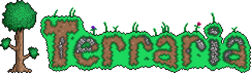

---
layout: default
---
# Games

### > This website allows for free games to play in school
### > Saving for games will not work unless you use the same PC/Laptop, so do not expect your saves to carry over. 
### > If you wish to manually transfer your saves go ahead, but i'm not writing out a guide for each game.
### > If you wish to request something, add an issue in the github page with your request. **Do not request large games**
***
## Html Minecraft

### Description
This a html file which are versions of older minecraft with browser compatibility. _Usually has a slow loading time_, but is easy to use and an effective way to run old minecraft quickly without installing anything. **Online usually doesn't work on school wifi.**
### Downloads
* <a href="https://astraclientorg.github.io">Astraclient 1.8.8 </a>- **Shaders. Includes Singleplayer**
* <a href="https://drive.google.com/file/d/1dafWS77rqUnlfCwBji2bL6kWj-DLS8rH/view?usp=sharing">Drive Download</a> - Original eaglercraft multiple versions (1.3, 1.5.2, 1.8 _Doesn't have singleplayer_) - 27MB

## Terraria

### Description
A downloadable EXE file which works on any pc. Just unzip the file onto your desktop and run the .exe file in the /terraria folder. **Ignore the redist and readme files**
### Downloads
* <a href="https://drive.google.com/file/d/1ByOmEvxGY_XckDHkP_LsxIRTf01nYcXq/view?usp=sharing">Terraria 1.4.49</a>- Full game of newest version - 570.2MB
